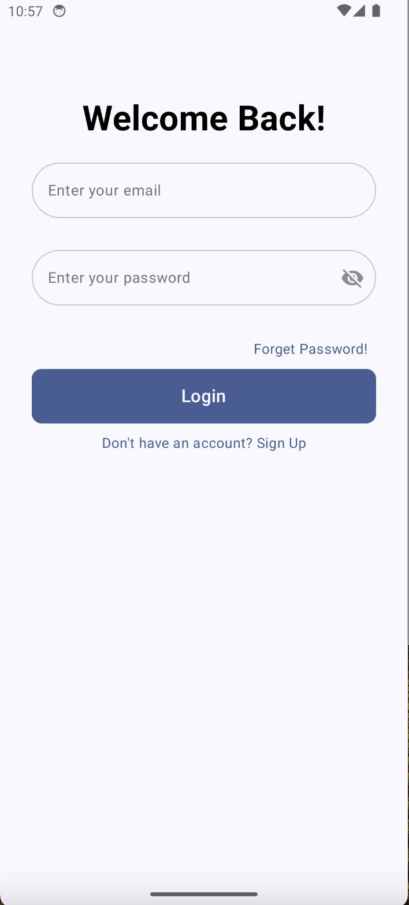
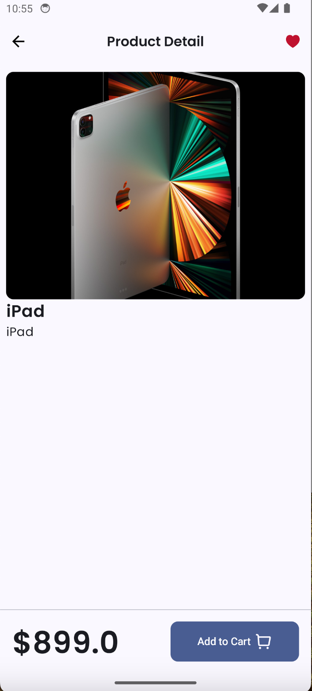
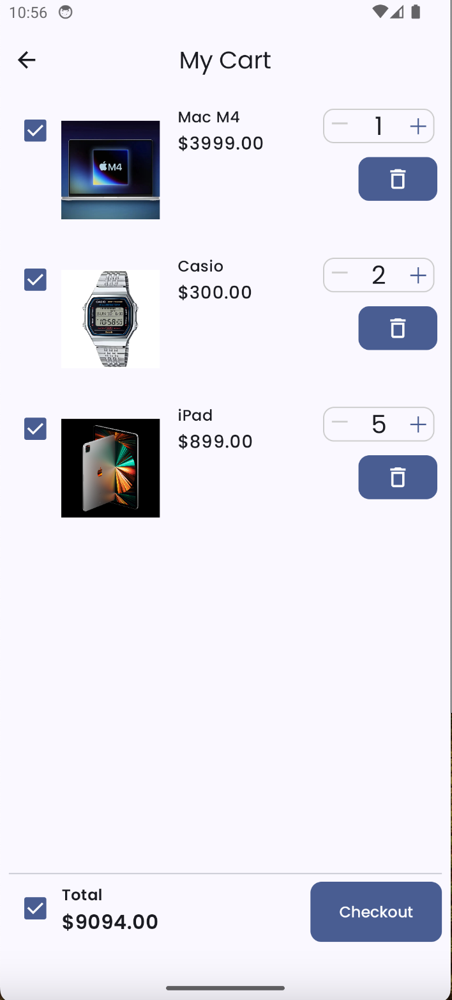
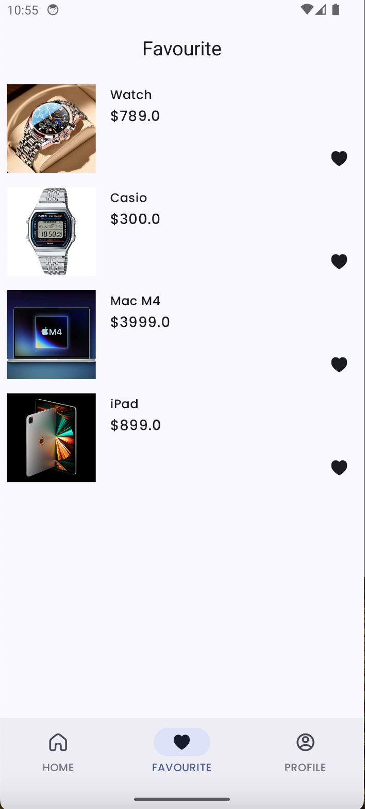
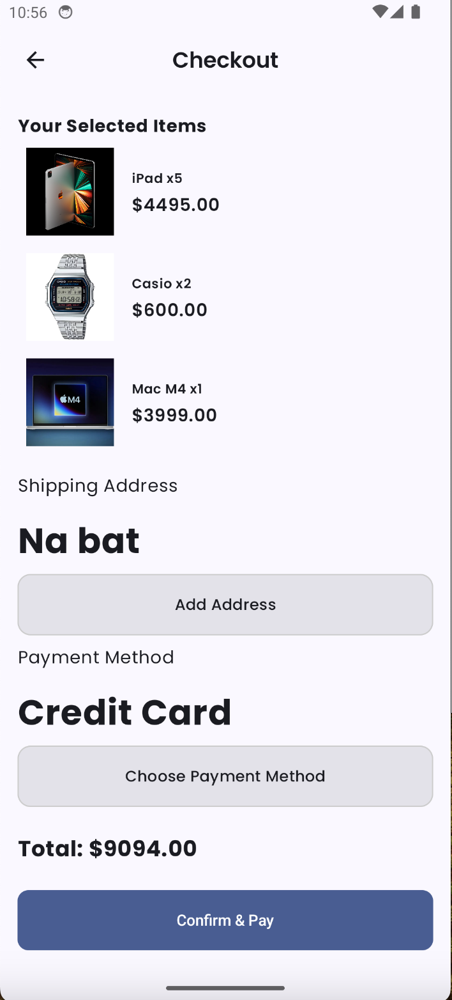
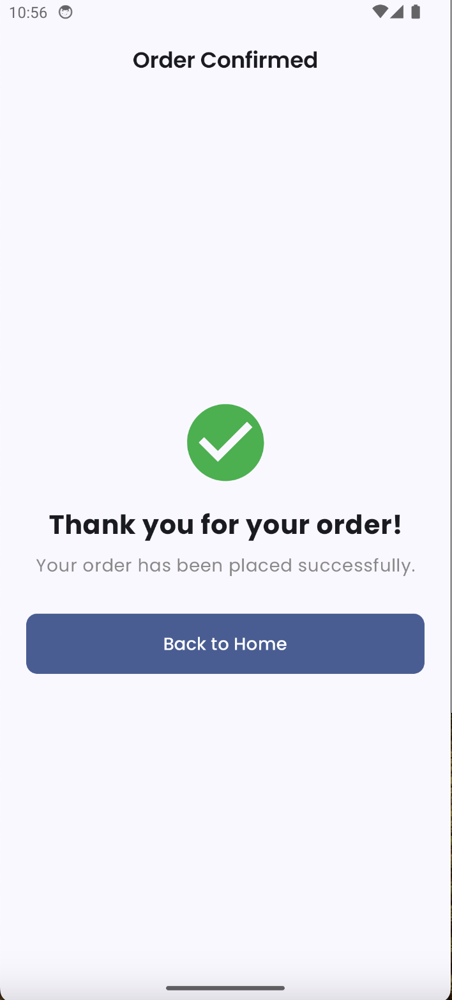
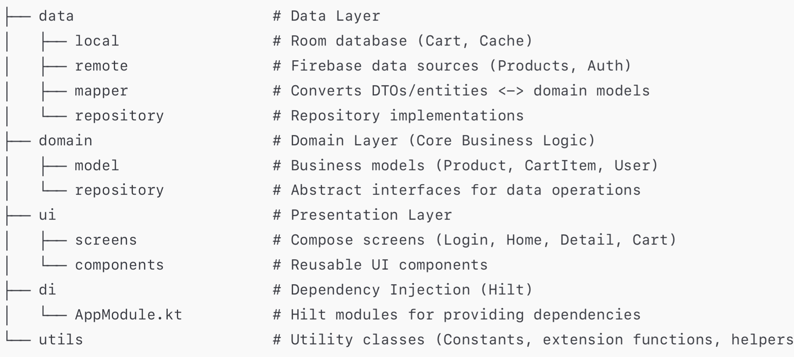

# 🛍️ Droid Shop – Modern E-Commerce App with Jetpack Compose

A fully functional and beautifully designed shopping app built with **Jetpack Compose**, **Firebase**, **Room**, **StateFlow**, and **Hilt**. This project showcases my ability to take an inspired UI/UX and refactor it into a real-world, scalable app using clean architecture and modern Android tools.

>📌 **Inspiration:
This project’s UI/UX was inspired by this YouTube video([Watch Here](https://youtu.be/wLzXLRInSRM?si=UzKoS7dlv6zdDRLw)) and  [this GitHub repository](https://github.com/dwiaziprasetya/VibeStore).
I rebuilt the app using a completely different codebase, added modern Android architecture (MVVM, Hilt, Room, StateFlow), and used Firebase for authentication and data storage.

---

## ✨ Features

- 🔐 Firebase Authentication (Email/Password)
- 🧾  product data via Firebase Firestore
- 🛒 Shopping cart with quantity control and checkout
- 🗂️ MVVM + Clean Architecture
- 💾 Offline support with Room
- 🌙 Material 3 
- 🔁 StateFlow for reactive UI
- 🧩 Modular structure with Hilt for dependency injection

  
  

  
  

  
  

  

> ✅ The app follows **Clean Architecture** with a clear separation of concerns, testability, and maintainability.

---

## 🧑‍💻 Tech Stack

| Layer        | Technology |
|--------------|------------|
| Language     | Kotlin     |
| UI           | Jetpack Compose + Material 3 |
| Architecture | MVVM + Clean Architecture |
| State        | StateFlow (Reactive UI) |
| Backend      | Firebase Authentication + Firestore |
| Database     | Room       |
| DI           | Hilt       |
| Navigation   | Compose Navigation |

## Architecture

The application adopts a **modified Clean Architecture** pattern, emphasizing separation of concerns. While it maintains distinct data and presentation layers, **Viewmodels directly interact with Repositories**, bypassing a dedicated use case layer for simplicity in this project.

* **`data`**: Handles all data retrieval and storage operations from various sources (local database, remote API).
* **`domain`**: Contains the core business models and abstract repository interfaces, ensuring business rules are independent of data sources or UI.
* **`ui`**: Deals with the presentation layer, including Jetpack Compose UI elements and ViewModels that directly consume data from the repositories.
* **`di`**: Manages dependency injection using Hilt.
* **`utils`**: Contains common utility functions, constants, and helpers.

---

## Project Structure
  

